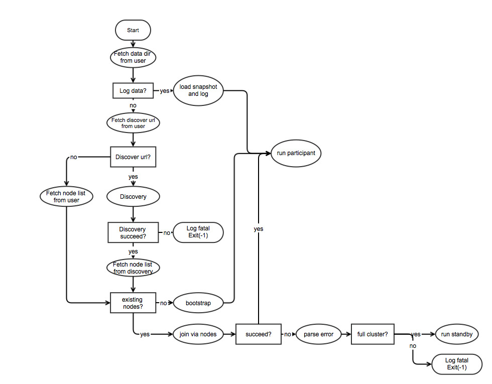

## Cluster Finding Process

### Sources

Etcd uses following sources to find cluster or bootstrap its own: data directory in `-data-dir`, discover url in `-discovery` and advised peers in `-peers`.

### Logical Workflow



```
If previous log exists:
	Load snapshot and log
	Run participant

If discover url is given:
	Fetch peers from discover url and register itself
	If failed:
		Exit
	Set peer list to discovered peers
Else if advised peers are given:
	Set peer list to advised peers
Else:
	Set peer list to empty

If peer list has existing nodes:
	Join via peer list
	If succeed:
		Run participant
	Else:
		Parse join failure
		If failed because the cluster has been full:
			Run standby
		Else:
			Exit
Else:
	Bootstrap a new cluster
	Run participant
```

*Note*: Participant node enrolls in raft consensus, while standby node only proxies requests.

### Common Use Cases

#### Start Cluster Using Discovery Service

Make all nodes use the same discover url.

The first registered node bootstraps the cluster, and all the others join the cluster one by one through hints from discovery service.

The ones rejected by the reason of full cluster go into standby mode.

#### Start Cluster Using Advised Peers

Start the first node without any advised peers, which bootstraps the cluster.

Use the address of that node as advised peer for all the other nodes, which join the cluster one by one.

The ones rejected by the reason of full cluster go into standby mode.

#### Reboot One Node

If there exists previous log, the node loads it and restarts.

#### Reboot One Outdated Node

The node starts serving, but it cannot connect to any peers and make any progress.

Administrator could find that etcd will print out warnings about disconnection, and machines listed in its http API are totally different from the ones in the cluster.

He/She could remove the old data and join the cluster as a new node, considering the node is totally outdated.

#### Reboot One Node Of Another Cluster

The node starts serving, but it cannot connect to any peers and make any progress.

Administrator could find that etcd prints out warnings about unmatched cluster id.

He/She should check the setting of each node, and split interleaved clusters.

#### Full Recovery

Users are expected to use old arguments to start etcd again.

Each node starts itself using the rule of rebooting one node.

Participants find the others, elect out one leader and work as a cluster.

The others send join requests to the cluster, and become standby when rejected due to full capacity.

### Inside Ideas

1.

If previous log is provided, it is loaded to reconnect/recover the cluster, while discover url and advised peers are ignored. This case happens a lot when restarting etcd due to outage or upgrade.

The reason to use log only as source is that it is believed to have most updated cluster info. This is based on our assumption that no single machine will be offline so long that all old nodes have been removed from the cluster.

2.

If discover url is given for a new node, peer list will be fetched from it. Discovery service helps users build cluster by using a unique discover url, which makes life easier because there is no need to set advised peers or private DNS service for cluster initialization.

New node is required to register itself to discovery service always, which ensures the rule that if the node is in the cluster, it must be displayed in discovery service. The guarantee makes discovery service simple and correct.

3.

If advised peers are provided without discover url, they are treated as peer list. Peer list from this method is not as dynamic and up-to-date as discover service, but it is a great alternative if internet connection is unavailable.

4.

When peer list parsed from sources, etcd will join cluster by sending requests to them. Otherwise, it will bootstrap a new cluster.

When running, if discover url is provided, etcd sends heartbeat to it once per day. This helps discovery service record active nodes in each cluster slowly.
